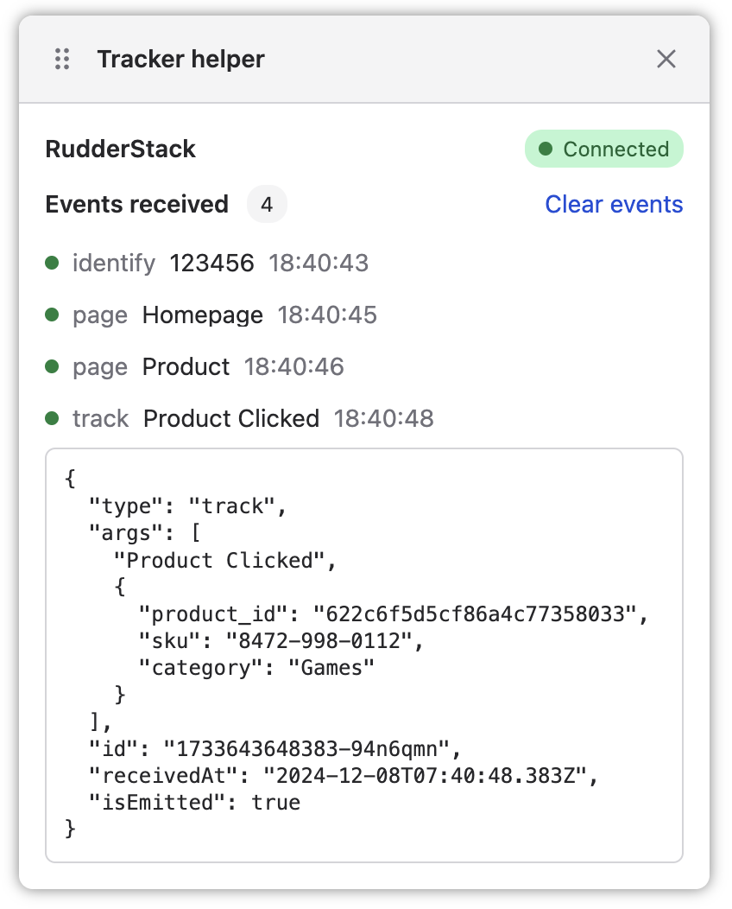

# react-tracker

> React hook for sending events to RudderStack and Segment

[](https://npmjs.com/@dangreaves/react-tracker)


This package exports a React hook which makes loading and sending events to the [RudderStack](https://www.rudderstack.com/docs/sources/event-streams/sdks/rudderstack-javascript-sdk), [Segment](https://segment.com/docs/connections/sources/catalog/libraries/website/javascript) or other Segment-compatible JavaScript tracking SDKs easier.

It also exports a `TrackerHelper` component which renders a floating debug window, similar to the [Shopify Pixel Helper](https://help.shopify.com/en/manual/promoting-marketing/pixels/custom-pixels/testing#shopify-pixel-helper), showing an expandable list of tracking events as they are received.



## Installation

```sh
npm install @dangreaves/react-tracker
```

## Loading a JavaScript SDK

To send events, you must first load the appropriate JavaScript SDK for your Segment-compatible tracking service.

Create a React component which imports your chosen JavaScript SDK, and when ready, pass it to the `init` method from the `useTracker` hook. Render that React component somewhere globally in your app.

In this example, we are using the [RudderStack JavaScript SDK](https://www.rudderstack.com/docs/sources/event-streams/sdks/rudderstack-javascript-sdk).

```tsx
import { useTracker } from "@dangreaves/react-tracker";
import { RudderAnalytics } from "@rudderstack/analytics-js";

const rudderAnalytics = new RudderAnalytics();

function Tracker() {
  const tracker = useTracker();

  useEffect(() => {
    rudderAnalytics.load(
      "abcdefxyjihjklmnopqrstuvwxyz",
      "https://abc123.dataplane.rudderstack.com",
    );

    rudderAnalytics.ready(() => {
      tracker.init({ tracker: rudderAnalytics });
    });
  }, [tracker]);

  return null;
}
```

## Sending events

To send an event to the tracker, use the `useTracker()` hook.

You can send events to the tracker at any time, even before the SDK's have connected. The events will be buffered and sent to the SDK's when ready.

```tsx
import { useTracker } from "@dangreaves/react-tracker";

function Component() {
  const tracker = useTracker();

  return (
    <button onClick={() => tracker.track("Button clicked", { foo: "bar" })}>
      Click me
    </button>
  );
}
```

## Rendering the helper

The `TrackerHelper` component shows a floating window to debug events sent to the tracker. It shows the status of connected SDK's, and the status for each event. Each event can be expanded to show the full JSON payload which was sent to the SDK.

```tsx
import { TrackerHelper } from "@dangreaves/react-tracker";

function Component() {
  return <TrackerHelper />;
}
```

When you have rendered the component on the page, you must activate it to show it. You can do this in a few ways.

1. Append `?enableTrackerHelper` to the URL and refresh the page
2. Set the `react-tracker-helper-enabled` local storage key to `true`

To close the helper, click the close button, which will set the `react-tracker-helper-enabled` local storage key to `false`.

If you would like to manually control the helper visibility, you can use the `enabled` and `onClose` props instead.

```tsx
import { useState } from "react";
import { TrackerHelper } from "@dangreaves/react-tracker";

function Component() {
  const [enabled, setEnabled] = useState(false);

  return <TrackerHelper enabled={enabled} onClose={() => setEnabled(false)} />;
}
```
